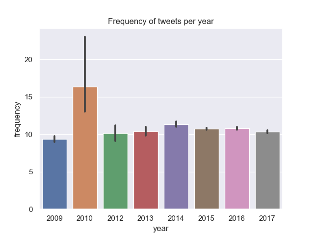
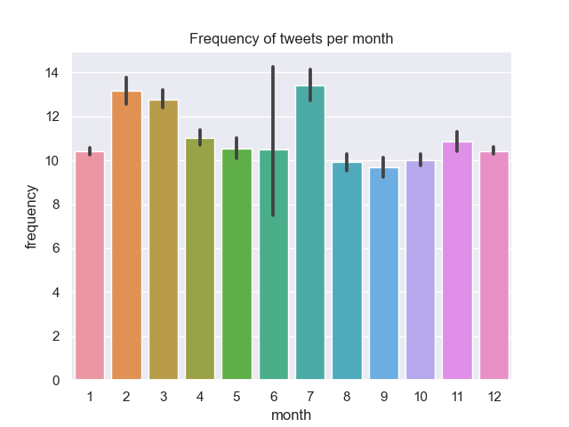
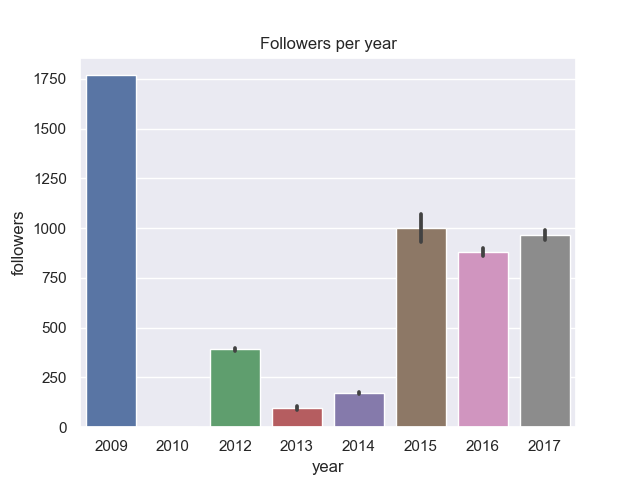
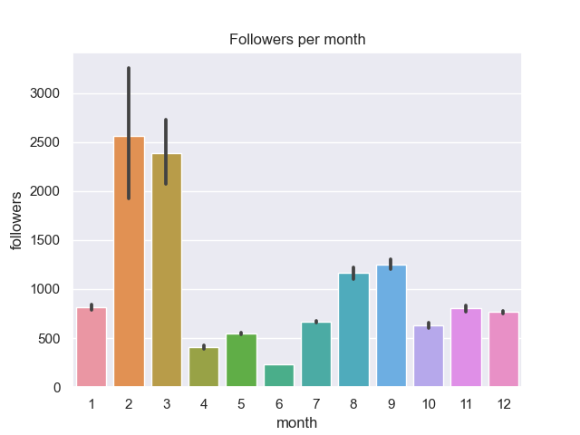
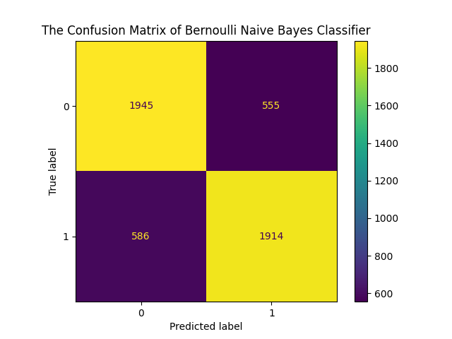
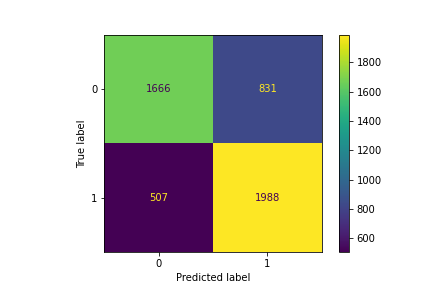

# Introduction

The data is in uncleaned format and is collected using Twitter API. The Tweets has been filtered to keep only the English context. It targets mental health classification of the user at Tweet-level.  
Data structure:  

| Post Date | Time of the tweet being published.                                 |
|-----------|--------------------------------------------------------------------|
| Text      | The content of this tweet.                                         |
| Followers | The number of followers of this account.                           |
| Friends   | The number of friends (followed by and following) of this account. |
| Favorites | The number of "like"s.                                             |
| Statuses  | The number of activities of the account owner.                     |
| Retweet   | The number of retweets.                                            |
| Label   | The mental status, whether depression or not. |  

In this study, we are going to use this data to predict the mental health status of twitter users based on their tweets. Before starting the project, I browse some other projects using this dataset and explore their methods to predict the mental status of a user. There are some studies predicting the mental status only using post texts, and they generally reach 70%-80% accuracy. However, there is [a project](https://www.kaggle.com/code/injectorash/feature-extraction-nlp-classification-with-rfc) using a simple random forest classifier that achieves the 100% accuracy on predicting the label. The project uses not only the post texts but also the user information in thie dataste. The high accuracy may imply that there are some spurious correlation between the label and other information caused by the way that data was collected (i.e., the label information was leaked when they collected the user information), otherwise it is unlikely that the mental status can be 100% predicted by a user's information. Hence, we would only focus on predicting users' mental status using their tweets.

# Filtering and EDA

## 1. Data preprocessing & Text cleaning

There are neither NAs nor replication samples in this data. Hence, we only perform a standard text cleaning pipeline:

- Lowercase the tweets

- Remove links, topics, punctuation, retweet markers, symbols and emoji

- We don't remove stop words at this stage, and leave it for further analyses

```{r, eval=FALSE}
clean_tweet <- function(text){
  text <- gsub("?(f|ht)(tp)(s?)(://)(.*)[.|/](.*)", "", text)
  text <- gsub("@\\S*", "", text) 
  text <- gsub("[\r\n]", "", text)
  text <- gsub("[[:punct:]]", "", text)
  text <- gsub("[^\x01-\x7F]", "", text)
  text <- gsub("amp ", "", text)
  text <- gsub("rt ", "", text)
  text <- gsub("\\d+\\w*\\d*", "", text)
  text <- gsub("\n", " ", text)
  text <- gsub("^\\s+", "", text)
  text <- gsub("\\s+$", "", text)
  text <- gsub("[ |\t]+", " ", text)
  return(text)
}
```

## 2. EDA

Fortunately, the data description website tells us that the label is evenly distributed. However, we are also curious about whether other features are well distributed. Can the data represent the population?

### 2.1 Wordcount distribution


We find that the distributions of word count between two labels are very similar. They can be hardly distinguished by their length, and most of them are below 30 words.

### 2.2 Date distribution

#### 2.2.1 Tweet Length per month/year

Overally, the tweet length is well distributed by time. From the plot we know that this data collects tweets from 2009 to 2017, and tweets in 2010 are significantly longer than other years, which are generally uniformly distributed.



As for month, we find that tweets in Feb, March and July are longer than other months. This may imply that the data is either not very representative in those months and years, or the distribution of the population is related with time. 



#### 2.2.2 Followers per month/year

We find that followers are not uniformly distributed. The data collected very few accounts with followers in 2010-2014 (especially 2010), while tweets in 2009 were more likely to come from a popular account. This implies that tweets from 2009 to 2014 are biased.



The distribution for followers per month is also not uniformly distributed, and we find that they collected more accounts with considerable followers in Feb and March. If we were to do a time series analysis for the twitter discourse (e.g., popular topics in March, 2010), then this dataset would not be the right choice.



### 2.3 Wordcloud

Wordcloud can tell us what people with or without depression are talking about on the Internet. We remove the stop words, calculate word frequency and draw the wordcloud for both labels.

#### 2.3.1 Negetiva Sample

For the depression, they are sharing their feeling and hardship on twitter. There are very few social or national topics, and they seem to struggle with disease and depression.


#### 2.3.2 Positive Sample

For positive samples, their tweets are more about social events and more positive words like love and happy. Their tweets are less personalized and more centralized - talking about a few popular topics.


# Prediction

We consider two methods for mental status prediction. One is naive Bayes, and the other is Bidirectional LSTM. I also tried random forest but it does not work well for classification. The train set and the test set are splitted in the following way:

```{python, eval=FALSE}
from sklearn.model_selection import train_test_split
X_train, X_test, y_train, y_test = train_test_split(data, y, stratify = y, random_state = 611)
```

The argument `stratify` ensures the distribution of y is promising in both the train set and the test set. 

## Bernoulli Naive Bayes

Naive Bayes is one of the most traditional text classification method. We feed TF-IDF into the model and train a binary classifier for the label. Overally, we obtain 77.18% accuracy on the test set. The result is consistent with [this post](https://www.kaggle.com/code/merencelebi/nlp-for-depression-prediction).



| Measure   | Value  |
|-----------|--------|
| Accuracy  | 0.7718 |
| Precision | 0.7656 |
| Recall    | 0.7752 |
| F-1 Score | 0.7704 |

To be more detailed, we firstly remove the stop words of the data and calculate the word counts for the dataset. Based on the word count, TF-IDF can be calculated.

```{python, eval=FALSE}
from sklearn.feature_extraction.text import CountVectorizer
from sklearn.feature_extraction.text import TfidfTransformer

count_vector = CountVectorizer(stop_words="english")
tfidf_transformer = TfidfTransformer()
X = count_vector.fit_transform(df.post_text)
X = tfidf_transformer.fit_transform(X)
```

The we fit the model with TF-IDF and labels.

```{python, eval=FALSE}
from sklearn.naive_bayes import BernoulliNB
BNB = BernoulliNB()
clf = BNB.fit(x_train, y_train)
```

Though not included in this report, I also verified that Bernoulli Naive Bayes had a better performance than Random Forest and [Gaussian Naive Bayes](https://www.kaggle.com/code/merencelebi/nlp-for-depression-prediction). The author claimed a 77.2% accuracy, but it was only 70% given the same preprocessed data on my device. We didn't lemmatize the posts in this analysis, which would probably hurt the performance of Naive Bayes.

## Bidirectional LSTM

Following [this project](https://www.kaggle.com/code/tmishinev/nlp-depression-tweets-keras-lstm/notebook) using Bidirectional LSTM to predict the label, I initially planned to replicate the experiment. However, since the version of `keras` the author used was deprecated, I revise the model in pytorch, and cannot achieve the same performance as the author did. The result is as following:



| Measure   | Value  |
|-----------|--------|
| Accuracy  | 0.7320 |
| Precision | 0.7968 |
| Recall    | 0.7052 |
| F-1 Score | 0.7482 |

Firstly, we tokenize the sentence with `nltk` and use one-hot representation of words. This is same as the tokenization in `keras`.

```{python, eval=FALSE}
data = [(word_tokenize(post_text)) for post_text in X]
X_train, X_test, y_train, y_test = train_test_split(data, y, stratify = y, random_state = 611)
index2word = ["<PAD>", "<SOS>", "<EOS>"]

for ds in [X_train, X_test]:
    for tweet in ds:
        for token in tweet:
            if token not in index2word:
                index2word.append(token)
word2index = {token: idx for idx, token in enumerate(index2word)}
```

Next, we pad and truncate the tweets to a specific length, say 40. This is also consistent with their `keras` code.

```{python, eval=FALSE}
def encode_and_pad(tweet, length, word2index):
    sos = [word2index["<SOS>"]]
    eos = [word2index["<EOS>"]]
    pad = [word2index["<PAD>"]]

    if len(tweet) < length - 2: # -2 for SOS and EOS
        n_pads = length - 2 - len(tweet)
        encoded = [word2index[w] for w in tweet]
        return sos + encoded + eos + pad * n_pads 
    else: # tweet is longer than possible; truncating
        encoded = [word2index[w] for w in tweet]
        truncated = encoded[:length - 2]
        return sos + truncated + eos
```

Then, the author used two bidirectional LSTM and two fully connected layer with a drop-out layer with rate 0.5. I mimicked the structure, but make some revisions after several times of experiment:

- Cut down the dimension of embedding and hidden layer by 2

- Replace one fully connected layer with drop-out layer after LSTM

```{python, eval=FALSE}
class BiLSTM_SentimentAnalysis(torch.nn.Module) :
    def __init__(self, vocab_size, embedding_dim=64, hidden_dim=32, dropout=0.5, batch_size=64) :
        super().__init__()
        self.embedding = nn.Embedding(vocab_size, embedding_dim, padding_idx=0)
        self.lstm = nn.LSTM(embedding_dim, hidden_dim, num_layers=2, batch_first=True, bidirectional=True)
        self.fc = nn.Sequential(
            nn.Linear(2*hidden_dim, 2*hidden_dim),
            nn.Dropout(dropout),
            nn.ReLU()
        )
        self.dropout = nn.Dropout(dropout)
        self.dense = nn.Sequential(
            nn.Linear(2*hidden_dim, 1),
            nn.Sigmoid()
        )
        self.batch_size = batch_size

    def forward(self, x, hidden):
        """
        The forward method takes in the input and the previous hidden state 
        """
        embs = self.embedding(x)
        out, hidden = self.lstm(embs, hidden)
        out = self.dropout(out)
        # out = self.fc(out)
        out = self.dense(out)
        out = out.squeeze()
        out = out[:, -1]
        return out, hidden
    
    def init_hidden(self):
        return (torch.zeros(4, self.batch_size, 32), torch.zeros(4, self.batch_size, 32))
```

The reason I made such adjustments is that the neural network always falls into overfiting. It easily reaches more than 95% accuracy on the training set, and then falls to 65% on the validating set. Hence, I shrink the parameters of the network, and cut down the number of fully connected layers which is less robust than LSTM. This helps improve the performance, but not much. The network still works less better than the Naive Bayes, and still suffers from overfiting.

# Conclusion

In this project, we tested two models of NLP classification. Theoretically, deep learning methods would outperform a lot by tranditional machine learning methods. However, in our case, the deep learning method suffers from overfitting, and machine learning method are more robust. 